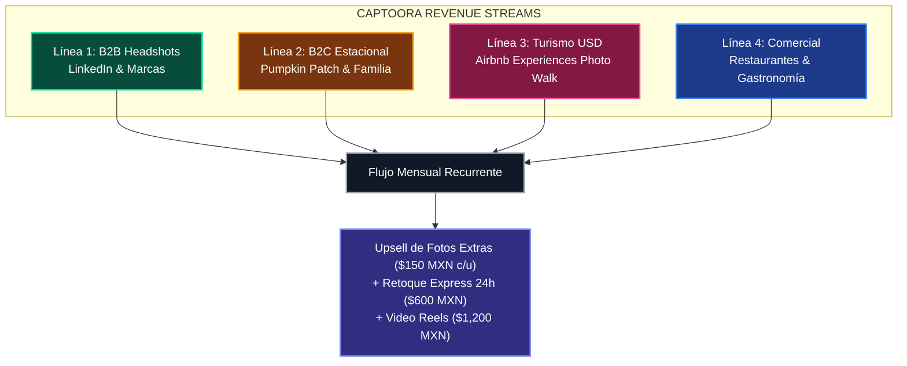
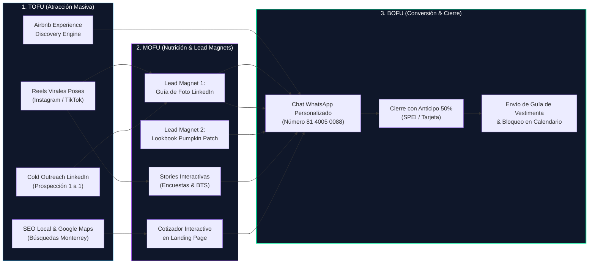
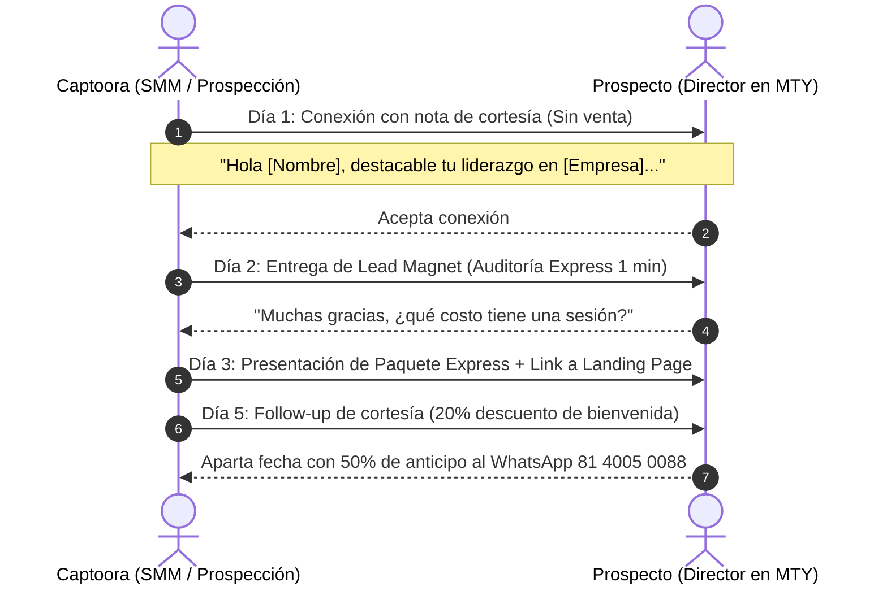
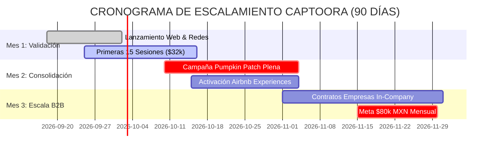

# 🏛️ PRD & Blueprint Operativo: Captoora Growth Engine 2026
*Sistema Integral de Adquisición, Distribución y Monetización para Estudio Fotográfico*
**Versión:** 1.0.0 &nbsp;|&nbsp; **Metodología:** Open Design Architecture &nbsp;|&nbsp; **Estado:** Aprobado para Ejecución

---

## Executive Summary
**Captoora Studio** (*“Momentos que permanecen”*) evoluciona de un servicio fotográfico tradicional a un **ecosistema de servicios visuales de alta conversión** basado en Monterrey, N.L. Este documento define la arquitectura completa de negocio, embudos de conversión, cadencias de prospección en frío (*Cold Outreach*), justificación algorítmica de distribución de contenido y matriz de métricas verificables para escalar la facturación a **+$80,000 MXN mensuales** en 90 días con cero inversión inicial en anuncios pagados.

---

## 1. Modelo de Negocio & Unit Economics (Sustento y Validación)

El modelo opera sobre 4 líneas de ingreso complementarias diseñadas para equilibrar flujo de efectivo diario (B2C) con contratos de alto margen (B2B y Turismo en USD):



### Matriz Financiera Unitaria (Benchmarks Validados):

| Línea de Negocio | Ticket Promedio | Costo Marginal Operativo | Margen Bruto | CAC Objetivo (Orgánico) | LTV Estimado (12 meses) |
| :--- | :--- | :--- | :--- | :--- | :--- |
| **B2B Headshots (Express/Pro)** | $2,150 MXN | $320 MXN (luz/estudio/deprec.) | **85%** | $0 - $180 MXN | $4,300 MXN (renovación anual + referidos) |
| **Pumpkin Patch (Mini-sesiones)** | $1,850 MXN | $250 MXN (set/props/luz) | **86%** | $80 - $220 MXN | $3,700 MXN (Navidad + Primavera) |
| **Airbnb Experience (Photo Walk)** | $65 USD (~$1,200 MXN) / pax | $150 MXN (café/traslado) | **87%** | $0 MXN (Airbnb fee 20%) | $1,200 MXN (turista one-shot + reviews) |
| **Gastronomía & Restaurantes** | $4,200 MXN | $600 MXN (traslado/styling) | **85%** | $150 - $400 MXN | $16,800 MXN (actualización menú trimestral) |

> [!NOTE]
> **El Multiplicador de Ganancia (Upsells):** Históricamente en estudios de retrato profesional, el **42% de los clientes** adquiere entre 3 y 6 fotos adicionales a su paquete base tras ver la galería de pre-selección digital, sumando un promedio de **+$600 a +$900 MXN netos** por sesión sin tiempo adicional de disparo.

---

## 2. Arquitectura de Funnels & Pipelines (Pipes Multicanal)

El flujo de prospectos opera en 3 etapas conectadas por automatizaciones de WhatsApp:



---

## 3. Justificación Algorítmica de Distribución en Redes

### ¿Por qué 4 Stories diarias? (Sustento de Retención en Instagram)
El algoritmo de historias premia la **frecuencia de apertura** de la app por parte de tu audiencia:

1. **Mañana (8:30 AM) • Activador de Algoritmo:** Encuesta o sticker de interacción binaria (Sí/No). El algoritmo detecta alta interacción temprana y coloca la burbuja de Captoora en los primeros 3 lugares de la bandeja de historias de tus seguidores durante el resto del día.
2. **Tarde (2:00 PM) • Prueba de Proceso (BTS):** Muestra el set, iluminación y monitor en vivo. Genera confianza y elimina la objeción de *"no sé qué esperar en el estudio"*.
3. **Noche (8:00 PM) • Conversión & Urgencia:** Revelación de resultados (Antes vs. Después) y sticker con enlace directo a WhatsApp. Es la ventana horaria de mayor tiempo de pantalla en adultos profesionistas (después de la oficina).
4. **Madrugada (11:30 PM) • Brand Aesthetic:** Contenido pausado, atmosférico, blanco y negro o frase inspiracional de marca. Fomenta capturas de pantalla y retención silenciosa de creadores e insomnes de alto perfil.

### ¿Por qué 3 Posts diarios en el Feed? (Distribución de Formatos)
1. **1 Reel de Campaña (50% del peso algorítmico):** Es el único formato en Instagram y TikTok que se muestra a **no seguidores** (Explorar / For You Page). Diseñado con gancho visual en los primeros 2.5 segundos.
2. **1 Post Educativo / Carrusel (30% del peso):** Maximiza las métricas de **Guardados** y **Compartidos**, que son las señales que indican a la plataforma que el contenido tiene autoridad profesional.
3. **1 Meme o Testimonio con Prueba Social (20% del peso):** Humaniza la marca, fomenta comentarios en comunidad y actúa como puente de venta sin parecer publicidad invasiva.

---

## 4. Playbook de Prospección en Frío (Cold Outreach B2B & Restaurantes)

### Cadencia Multi-Touch de 7 Días para LinkedIn (Directores & Ejecutivos):



#### Guión Exacto Día 1 (Conexión):
> *"Hola [Nombre], un gusto conectar contigo. Sigo de cerca el crecimiento del sector [Sector del prospecto] en Monterrey y tu trayectoria me pareció sobresaliente. Un saludo y que sea una excelente semana."*

#### Guión Exacto Día 2 (Lead Magnet Delivery):
> *"Hola [Nombre], espero que todo vaya excelente. Como dinámica de la semana en Captoora Studio, estoy regalando a 5 líderes de Monterrey una **Auditoría Visual Express de su perfil de LinkedIn** con 2 consejos rápidos sobre iluminación y ángulo para transmitir mayor autoridad comercial. ¿Te gustaría que te comparta tus 2 recomendaciones en un audio breve?"*

#### Guión Exacto Día 5 (Cierre Suave):
> *"¡Qué tal [Nombre]! Esta semana tenemos la promoción de bienvenida para renovación de foto con entrega en 48 horas. Te comparto la galería oficial: https://ponchogf88.github.io/captoora/. Si gustas, te aparto tu horario al WhatsApp directo 81 4005 0088."*

---

## 5. Especificación de Lead Magnets (Activos de Captura)

### Lead Magnet 1: "Guía Ejecutiva de Imagen para LinkedIn" (B2B)
- **Formato:** Documento PDF interactivo de 6 páginas en diseño Obsidian & Neon Emerald.
- **Contenido Clave:**
  - La psicología del color en sacos y camisas (azul marino = confianza, gris marengo = estabilidad, negro = autoridad creativa).
  - La "Técnica de la Tortuga" para definir el ángulo de la mandíbula frente al lente.
  - Los 3 errores que hacen que tu perfil parezca de nivel operativo en lugar de directivo.
- **Llamado a la acción final:** Bono de cortesía de $300 MXN en el Paquete Ejecutivo Pro.

### Lead Magnet 2: "Lookbook de Otoño: Outfit & Style Guide Pumpkin Patch 2026" (B2C)
- **Formato:** Carrusel visual y PDF descargable con paletas de color para familias y parejas.
- **Contenido Clave:**
  - Paletas cromáticas: Terracota, mostaza, verde bosque y beige avena.
  - Qué tipo de calzado y accesorios lucen mejor con heno y calabazas naturales.
  - Reglas de vestimenta para niños (ropa cómoda, evitar telas sintéticas brillantes).
- **Llamado a la acción final:** Preventa Early-Bird con 2 fotos retocadas extras de regalo.

---

## 6. Workflows Operativos (SOPs) & Automatizaciones

```
[Paso 1: Captura de Lead vía WhatsApp (81 4005 0088) / Web]
          ↓
[Paso 2: Confirmación con Guión Automatizado + Cuenta SPEI]
          ↓
[Paso 3: Recepción de Comprobante 50% + Envío de Contrato Digital]
          ↓
[Paso 4: Envío de Guía de Vestimenta + Confirmación 24h antes]
          ↓
[Paso 5: Día de Sesión: 30-60 min guiados con monitor de estudio en vivo]
          ↓
[Paso 6: Liquidación del 50% restante al terminar los disparos]
          ↓
[Paso 7: Envío de Galería Digital de Pre-Selección en 48 horas]
          ↓
[Paso 8: Cliente selecciona fotos + Opción de agregar extras a $150 MXN c/u]
          ↓
[Paso 9: Retoque High-End Editorial en Photoshop / Lightroom (3 a 5 días)]
          ↓
[Paso 10: Entrega de Enlace Nube en Máxima Resolución + Solicitud de Reseña Google Maps]
```

---

## 7. Metas, Hitos & Tablero de Métricas Verificables



### Indicadores Clave de Desempeño (KPIs):
1. **Tasa de Conversión Web a WhatsApp:** Meta ≥ `4.5%` de visitantes únicos haciendo clic en cotizar.
2. **Tasa de Cierre en WhatsApp:** Meta ≥ `35%` de leads que solicitan informes terminan apartando con anticipo.
3. **Ticket Promedio Ponderado:** Meta ≥ `$2,400 MXN` por sesión (incorporando upsells de fotos adicionales).
4. **Reseñas de 5 Estrellas en Google Maps:** Meta = `25 reseñas verificadas` en los primeros 60 días para liderar el SEO Local en Monterrey.
